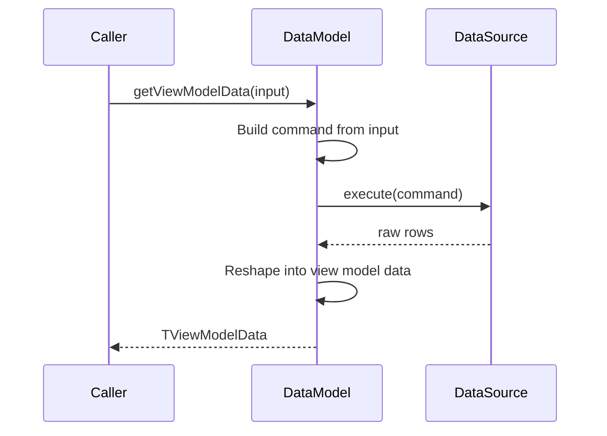

`DataModel<TInput, TViewModelData>` is the abstract base class that sits between a <Term id="data-source">data source</Term> and the renderer. Subclasses fetch raw data from the data source and transform it into a structure the renderer can display directly.

<auto-class-outline path="packages/grid/src/datamodel/datamodel.ts" name="DataModel" title="Outline" />

- `TInput` - the input that describes what data to produce (e.g. a pivot config, a row range query)
- `TViewModelData` - the output shape the renderer expects

**Example:**

A pivot data model takes a pivot config and returns reshaped pivot data:

```ts
const viewModelData = await pivotModel.getViewModelData({
  rows: "region",
  columns: cross("department", "revenue"),
});
```

A standard table data model takes a row query and returns flat rows:

```ts
const viewModelData = await flatModel.getViewModelData({
  startRow: 0,
  endRow: 100,
  groupBy: ["region", "country"],
  project: ["revenue", "cost"],
  sort: [],
  filter: [],
  groupPath: [],
});
```

## Responsibilities

A data model does two things:

- Decides which command to send to the data source to fetch the data
  - A WASM SQL implementation prepares a SQL query that the data source executes to transform (groupby, select,
    project, window etc) fetch and transform the data
  - An API implementation sends a payload JSON object to the server, which handles the transformation and returns the rows
- Reshapes the result (transforms the output if required) so that it can be rendered

The data source executes the command. The data model decides what command to run and what to do with the result.



## Built-in implementations

```text
DataModel<TInput, TViewModelData>
|-- PivotTableDataModel
|   |-- SqlPivotTableDataModel
|-- StandardTableDataModel
    |-- SqlStandardTableDataModel
```

| Class | What it does |
| --- | --- |
| `DataModel` | Abstract base. Holds the schema and exposes `getViewModelData`. |
| `PivotTableDataModel` | Reshapes flat query results into a 2D pivot grid with row/column facets. |
| `StandardTableDataModel` | Produces flat rows with optional row grouping, expand/collapse, and pagination. |
| `SqlPivotTableDataModel` | Extends `PivotTableDataModel` with SQL generation for SQL-backed data sources. |
| `SqlStandardTableDataModel` | Extends `StandardTableDataModel` with SQL generation for SQL-backed data sources. |

## Usage

`DataModel` is abstract and cannot be instantiated directly. The library provides built-in implementations for the most common data modelling patterns - `PivotTableDataModel` and `StandardTableDataModel`.

Most use cases can be achieved by using or extending those classes. If you need a completely new data modelling layer with no overlap with the built-in implementations, extend `DataModel` directly.

Typical flow:

1. Create a data source.

```ts
const ds = await DuckDBWasmDataSource.create();
await ds.loadData({ schema, data });
```

2. Create a data model, passing the schema and data source.

```ts
const model = new SqlPivotTableDataModel(schema, ds);
```

3. Call `getViewModelData` with a config or query. The data model builds a command, sends it to the data source, and returns view model data.

```ts
const viewModelData = await model.getViewModelData(pivotConfig);
```

4. Pass the view model data to a view model, which the renderer consumes.

## Implementing your own `DataModel`

If the built-in data models don't fit your use case, extend `DataModel` directly. You need to:

1. Define `TInput` - what the caller passes in (the config describing what data to produce)
2. Define `TViewModelData` - what the renderer expects back
3. Implement `getViewModelData` - build a command, send it to the data source, reshape the result

Example: a Kanban board data model backed by SQL. Columns are statuses, rows are swimlanes (e.g. priority). Each cell holds an array of task cards.

```ts
import { DataModel } from "grid";
import { SqlDataSource } from "grid";
import { DataSchema } from "grid";

type KanbanInput = {
  statusField: string;
  swimlaneField: string;
  cardFields: string[];
};

type KanbanCard = Record<string, any>;

type KanbanViewModelData = {
  statuses: string[];
  swimlanes: string[];
  cells: Map<string, KanbanCard[]>; // key: "swimlane::status"
};

class WasmSqlKanbanDataModel extends DataModel<KanbanInput, KanbanViewModelData> {
  private dataSource: SqlDataSource;

  constructor(schema: DataSchema[], dataSource: SqlDataSource) {
    super(schema);
    this.dataSource = dataSource;
  }

  async getViewModelData(input: KanbanInput): Promise<KanbanViewModelData> {
    const { statusField, swimlaneField, cardFields } = input;

    // Validate all fields against the schema (throws if not found)
    const allFields = [statusField, swimlaneField, ...cardFields];
    const quoted = allFields.map((f) => `"${this.getColumn(f).name}"`);

    // 1. Build the SQL command
    const sql = `SELECT ${quoted.join(", ")} FROM ${this.dataSource.table} ORDER BY "${statusField}", "${swimlaneField}"`;

    // 2. Send to data source
    const rows = await this.dataSource.execute(sql);

    // 3. Reshape into view model data
    const statuses = [...new Set(rows.map((r) => r[statusField]))];
    const swimlanes = [...new Set(rows.map((r) => r[swimlaneField]))];
    const cells = new Map<string, KanbanCard[]>();

    for (const row of rows) {
      const key = `${row[swimlaneField]}::${row[statusField]}`;
      if (!cells.has(key)) cells.set(key, []);
      cells.get(key)!.push(row);
    }

    return { statuses, swimlanes, cells };
  }
}
```

Usage:

```ts
const model = new WasmSqlKanbanDataModel(schema, dataSource);
const board = await model.getViewModelData({
  statusField: "status",
  swimlaneField: "priority",
  cardFields: ["title", "assignee", "due_date"],
});
// board.statuses  → ["todo", "in_progress", "done"]
// board.swimlanes → ["high", "medium", "low"]
// board.cells.get("high::todo") → [{ title: "Fix bug", ... }]
```

## API Reference

<auto-type-table path="packages/grid/src/datamodel/datamodel.ts" name="DataModel" />
