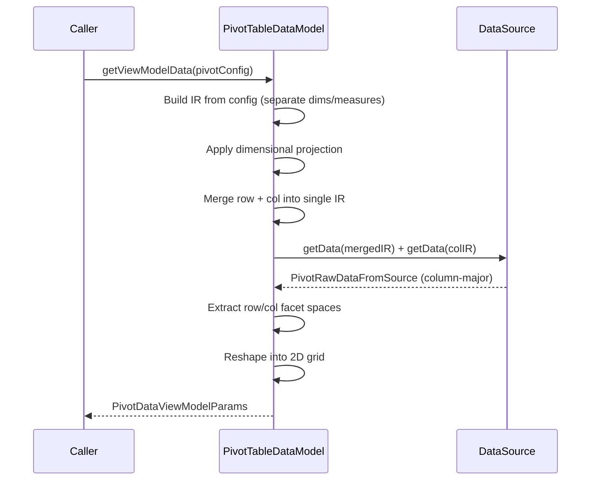

`PivotTableDataModel` is an abstract class that extends [DataModel](/docs/datamodel). It takes a `PivotConfig` that describes which fields go on rows, which go on columns, and which are measures - then reshapes flat query results into a 2D pivot grid with row facets, column facets, and aggregated data cells.

<auto-class-outline path="packages/grid/src/datamodel/pivot-table-datamodel.ts" name="PivotTableDataModel" title="Outline" exclude="PivotDataViewModelParams" />


- `TInput` is fixed to [`PivotConfig`](/docs/api-references/type-references#pivotconfig) - describes the row axis, column axis, filters, and sort
- `TViewModelData` is fixed to [`PivotDataViewModelParams`](/docs/api-references/type-references#pivotdataviewmodelparams) - the reshaped 2D grid the renderer expects

## Pivot grid structure

Data prepared for a pivot grid is placed on three axes:

- **Row axis** - the row facets (headers on the left side). Each row facet level is a dimension field.
- **Column axis** - the column facets (headers on the top). Each column facet level is a dimension field.
- **Values** - the data cells at the intersection of a row and a column. These are aggregated measures.

<div style={{ display: 'inline-grid', gridTemplateColumns: 'auto auto', gap: '4px', padding: '4px', background: 'var(--color-fd-border)', borderRadius: '6px', width: 'fit-content' }}>
  <div style={{ padding: '12px 24px', background: 'var(--color-fd-muted)', borderRadius: '3px', width: '120px' }}></div>
  <div style={{ padding: '12px 48px', background: 'var(--color-fd-muted)', borderRadius: '3px', textAlign: 'center', fontWeight: 600 }}>Column Axis / column facets</div>
  <div style={{ padding: '12px 24px', background: 'var(--color-fd-muted)', borderRadius: '3px', textAlign: 'center', fontWeight: 600, display: 'flex', alignItems: 'center', justifyContent: 'center' }}>Row Axis /<br/>row facets</div>
  <div style={{ padding: '48px 80px', background: 'var(--color-fd-background)', borderRadius: '3px', textAlign: 'center' }}>Values (measures)</div>
</div>

[`PivotConfig`](#pivotconfig) defines the row axis and column axis. Each axis is an [`AxisExpr`](/docs/api-references/type-references#axisexpr) - a tree that describes how fields are arranged on that axis. A field name that maps to a measure column in the schema becomes a value; a field name that maps to a dimension column becomes a facet level.

## Table algebra operators

The three operators `cross`, `concat`, and `hierarchy` compose fields from data into an `AxisExpr` tree. The renderer draws each axis based on this tree, making it possible to achieve any pivot configuration.

### cross - cartesian product

`cross(a, b)` produces every combination of values from `a` and `b` fields from data. Each argument becomes a facet level; all combinations are enumerated.

```ts
import { cross } from "grid";

// Quarter and Product are two columns in the data
// cross produces every quarter paired with every product
cross("Quarter", "Product")
```

<div style={{ display: 'inline-grid', gridTemplateColumns: 'repeat(8, auto)', gap: '1px', padding: '1px', background: 'color-mix(in srgb, var(--color-fd-foreground) 20%, var(--color-fd-background))', borderRadius: '6px', width: 'fit-content', fontSize: '13px' }}>
  <div style={{ padding: '6px 12px', background: 'color-mix(in srgb, var(--color-fd-foreground) 3%, var(--color-fd-background))', textAlign: 'center', fontWeight: 600, gridColumn: 'span 2' }}>Qtr1</div>
  <div style={{ padding: '6px 12px', background: 'color-mix(in srgb, var(--color-fd-foreground) 3%, var(--color-fd-background))', textAlign: 'center', fontWeight: 600, gridColumn: 'span 2' }}>Qtr2</div>
  <div style={{ padding: '6px 12px', background: 'color-mix(in srgb, var(--color-fd-foreground) 3%, var(--color-fd-background))', textAlign: 'center', fontWeight: 600, gridColumn: 'span 2' }}>Qtr3</div>
  <div style={{ padding: '6px 12px', background: 'color-mix(in srgb, var(--color-fd-foreground) 3%, var(--color-fd-background))', textAlign: 'center', fontWeight: 600, gridColumn: 'span 2' }}>Qtr4</div>
  <div style={{ padding: '6px 12px', background: 'color-mix(in srgb, var(--color-fd-foreground) 3%, var(--color-fd-background))', textAlign: 'center' }}>Coffee</div>
  <div style={{ padding: '6px 12px', background: 'color-mix(in srgb, var(--color-fd-foreground) 3%, var(--color-fd-background))', textAlign: 'center' }}>Tea</div>
  <div style={{ padding: '6px 12px', background: 'color-mix(in srgb, var(--color-fd-foreground) 3%, var(--color-fd-background))', textAlign: 'center' }}>Coffee</div>
  <div style={{ padding: '6px 12px', background: 'color-mix(in srgb, var(--color-fd-foreground) 3%, var(--color-fd-background))', textAlign: 'center' }}>Tea</div>
  <div style={{ padding: '6px 12px', background: 'color-mix(in srgb, var(--color-fd-foreground) 3%, var(--color-fd-background))', textAlign: 'center' }}>Coffee</div>
  <div style={{ padding: '6px 12px', background: 'color-mix(in srgb, var(--color-fd-foreground) 3%, var(--color-fd-background))', textAlign: 'center' }}>Tea</div>
  <div style={{ padding: '6px 12px', background: 'color-mix(in srgb, var(--color-fd-foreground) 3%, var(--color-fd-background))', textAlign: 'center' }}>Coffee</div>
  <div style={{ padding: '6px 12px', background: 'color-mix(in srgb, var(--color-fd-foreground) 3%, var(--color-fd-background))', textAlign: 'center' }}>Tea</div>
</div>

You can cross a dimension with a measure. The measure repeats under each dimension value:

```ts
// Quarter × Profit: one Profit column per quarter
cross("Quarter", "Profit")
```

<div style={{ display: 'inline-grid', gridTemplateColumns: 'repeat(4, auto)', gap: '1px', padding: '1px', background: 'color-mix(in srgb, var(--color-fd-foreground) 20%, var(--color-fd-background))', borderRadius: '6px', width: 'fit-content', fontSize: '13px' }}>
  <div style={{ padding: '6px 12px', background: 'color-mix(in srgb, var(--color-fd-foreground) 3%, var(--color-fd-background))', textAlign: 'center', fontWeight: 600 }}>Qtr1</div>
  <div style={{ padding: '6px 12px', background: 'color-mix(in srgb, var(--color-fd-foreground) 3%, var(--color-fd-background))', textAlign: 'center', fontWeight: 600 }}>Qtr2</div>
  <div style={{ padding: '6px 12px', background: 'color-mix(in srgb, var(--color-fd-foreground) 3%, var(--color-fd-background))', textAlign: 'center', fontWeight: 600 }}>Qtr3</div>
  <div style={{ padding: '6px 12px', background: 'color-mix(in srgb, var(--color-fd-foreground) 3%, var(--color-fd-background))', textAlign: 'center', fontWeight: 600 }}>Qtr4</div>
  <div style={{ padding: '6px 12px', background: 'color-mix(in srgb, var(--color-fd-foreground) 3%, var(--color-fd-background))', textAlign: 'center' }}>Profit</div>
  <div style={{ padding: '6px 12px', background: 'color-mix(in srgb, var(--color-fd-foreground) 3%, var(--color-fd-background))', textAlign: 'center' }}>Profit</div>
  <div style={{ padding: '6px 12px', background: 'color-mix(in srgb, var(--color-fd-foreground) 3%, var(--color-fd-background))', textAlign: 'center' }}>Profit</div>
  <div style={{ padding: '6px 12px', background: 'color-mix(in srgb, var(--color-fd-foreground) 3%, var(--color-fd-background))', textAlign: 'center' }}>Profit</div>
</div>

### concat - union

`concat(a, b)` places the values from `a` and `b` side by side on the same facet level. No combinations are generated; values are simply laid out in sequence.

```ts
import { concat } from "grid";

// Quarter values followed by Product values, all on one level
concat("Quarter", "Product")
```

<div style={{ display: 'inline-grid', gridTemplateColumns: 'repeat(8, auto)', gap: '1px', padding: '1px', background: 'color-mix(in srgb, var(--color-fd-foreground) 20%, var(--color-fd-background))', borderRadius: '6px', width: 'fit-content', fontSize: '13px' }}>
  <div style={{ padding: '6px 12px', background: 'color-mix(in srgb, var(--color-fd-foreground) 3%, var(--color-fd-background))', textAlign: 'center' }}>Qtr1</div>
  <div style={{ padding: '6px 12px', background: 'color-mix(in srgb, var(--color-fd-foreground) 3%, var(--color-fd-background))', textAlign: 'center' }}>Qtr2</div>
  <div style={{ padding: '6px 12px', background: 'color-mix(in srgb, var(--color-fd-foreground) 3%, var(--color-fd-background))', textAlign: 'center' }}>Qtr3</div>
  <div style={{ padding: '6px 12px', background: 'color-mix(in srgb, var(--color-fd-foreground) 3%, var(--color-fd-background))', textAlign: 'center' }}>Qtr4</div>
  <div style={{ padding: '6px 12px', background: 'color-mix(in srgb, var(--color-fd-foreground) 3%, var(--color-fd-background))', textAlign: 'center' }}>Coffee</div>
  <div style={{ padding: '6px 12px', background: 'color-mix(in srgb, var(--color-fd-foreground) 3%, var(--color-fd-background))', textAlign: 'center' }}>Espresso</div>
  <div style={{ padding: '6px 12px', background: 'color-mix(in srgb, var(--color-fd-foreground) 3%, var(--color-fd-background))', textAlign: 'center' }}>H.Tea</div>
  <div style={{ padding: '6px 12px', background: 'color-mix(in srgb, var(--color-fd-foreground) 3%, var(--color-fd-background))', textAlign: 'center' }}>Tea</div>
</div>

Concatenating measures puts them side by side:

```ts
// Profit and Sales as adjacent columns
concat("Profit", "Sales")
```

<div style={{ display: 'inline-grid', gridTemplateColumns: 'repeat(2, auto)', gap: '1px', padding: '1px', background: 'color-mix(in srgb, var(--color-fd-foreground) 20%, var(--color-fd-background))', borderRadius: '6px', width: 'fit-content', fontSize: '13px' }}>
  <div style={{ padding: '6px 12px', background: 'color-mix(in srgb, var(--color-fd-foreground) 3%, var(--color-fd-background))', textAlign: 'center' }}>Profit</div>
  <div style={{ padding: '6px 12px', background: 'color-mix(in srgb, var(--color-fd-foreground) 3%, var(--color-fd-background))', textAlign: 'center' }}>Sales</div>
</div>

### hierarchy - grouped nesting

`hierarchy(a, b)` nests `b` under `a`, but only shows combinations that actually exist in the data. Unlike `cross` (which enumerates all possible combinations), `hierarchy` produces only observed parent-child pairs.

```ts
import { hierarchy } from "grid";

// Months nested under their actual quarter
hierarchy("Quarter", "Month")
```

<div style={{ display: 'inline-grid', gridTemplateColumns: 'repeat(12, auto)', gap: '1px', padding: '1px', background: 'color-mix(in srgb, var(--color-fd-foreground) 20%, var(--color-fd-background))', borderRadius: '6px', width: 'fit-content', fontSize: '13px' }}>
  <div style={{ padding: '6px 12px', background: 'color-mix(in srgb, var(--color-fd-foreground) 3%, var(--color-fd-background))', textAlign: 'center', fontWeight: 600, gridColumn: 'span 3' }}>Qtr1</div>
  <div style={{ padding: '6px 12px', background: 'color-mix(in srgb, var(--color-fd-foreground) 3%, var(--color-fd-background))', textAlign: 'center', fontWeight: 600, gridColumn: 'span 3' }}>Qtr2</div>
  <div style={{ padding: '6px 12px', background: 'color-mix(in srgb, var(--color-fd-foreground) 3%, var(--color-fd-background))', textAlign: 'center', fontWeight: 600, gridColumn: 'span 3' }}>Qtr3</div>
  <div style={{ padding: '6px 12px', background: 'color-mix(in srgb, var(--color-fd-foreground) 3%, var(--color-fd-background))', textAlign: 'center', fontWeight: 600, gridColumn: 'span 3' }}>Qtr4</div>
  <div style={{ padding: '6px 12px', background: 'color-mix(in srgb, var(--color-fd-foreground) 3%, var(--color-fd-background))', textAlign: 'center' }}>Jan</div>
  <div style={{ padding: '6px 12px', background: 'color-mix(in srgb, var(--color-fd-foreground) 3%, var(--color-fd-background))', textAlign: 'center' }}>Feb</div>
  <div style={{ padding: '6px 12px', background: 'color-mix(in srgb, var(--color-fd-foreground) 3%, var(--color-fd-background))', textAlign: 'center' }}>Mar</div>
  <div style={{ padding: '6px 12px', background: 'color-mix(in srgb, var(--color-fd-foreground) 3%, var(--color-fd-background))', textAlign: 'center' }}>Apr</div>
  <div style={{ padding: '6px 12px', background: 'color-mix(in srgb, var(--color-fd-foreground) 3%, var(--color-fd-background))', textAlign: 'center' }}>May</div>
  <div style={{ padding: '6px 12px', background: 'color-mix(in srgb, var(--color-fd-foreground) 3%, var(--color-fd-background))', textAlign: 'center' }}>Jun</div>
  <div style={{ padding: '6px 12px', background: 'color-mix(in srgb, var(--color-fd-foreground) 3%, var(--color-fd-background))', textAlign: 'center' }}>Jul</div>
  <div style={{ padding: '6px 12px', background: 'color-mix(in srgb, var(--color-fd-foreground) 3%, var(--color-fd-background))', textAlign: 'center' }}>Aug</div>
  <div style={{ padding: '6px 12px', background: 'color-mix(in srgb, var(--color-fd-foreground) 3%, var(--color-fd-background))', textAlign: 'center' }}>Sep</div>
  <div style={{ padding: '6px 12px', background: 'color-mix(in srgb, var(--color-fd-foreground) 3%, var(--color-fd-background))', textAlign: 'center' }}>Oct</div>
  <div style={{ padding: '6px 12px', background: 'color-mix(in srgb, var(--color-fd-foreground) 3%, var(--color-fd-background))', textAlign: 'center' }}>Nov</div>
  <div style={{ padding: '6px 12px', background: 'color-mix(in srgb, var(--color-fd-foreground) 3%, var(--color-fd-background))', textAlign: 'center' }}>Dec</div>
</div>

### Composing operators

The operator signatures constrain how they compose:

```ts
function cross(...args: AxisExpr[]): AxisExpr;    // children can be strings or other operators
function concat(...args: AxisExpr[]): AxisExpr;   // children can be strings or other operators
function hierarchy(...fields: string[]): AxisExpr; // children must be plain field names (strings only)
```

`cross` and `concat` accept any `AxisExpr`, so they can nest other operators as children. `hierarchy` only accepts plain field names - it is always a leaf in the expression tree. You can place a `hierarchy` inside a `cross` or `concat`, but you cannot nest anything inside a `hierarchy`.

Example:

```ts
// Rows: region/country hierarchy
// Columns: each quarter shows both revenue and cost
const config: PivotConfig = {
  rows: hierarchy("region", "country"),
  columns: cross("quarter", concat("revenue", "cost")),
};
```

This produces a grid where:
- Rows show regions with countries nested beneath their actual region
- Columns show every quarter, and within each quarter, revenue and cost appear side by side

## How it works

When `getViewModelData(config)` is called, the model:

1. Converts the [`PivotConfig`](#pivotconfig) into an internal IR (intermediate representation) by separating dimensions from measures and building a [`DimSpec`](#dimspec) tree. `DimSpec` is the lowered form of `AxisExpr` - it mirrors the same tree structure (`simple`, `hierarchy`, `cross`, `concat`) but has filters attached to nodes and measures extracted into a separate list.
2. Applies [dimensional projection](#dimensional-projection) to the `DimSpec` if configured. Dimensional projection is the expand/collapse mechanism - it lets different values at the same facet level have different depths. For example, in `hierarchy("region", "country", "city")`, "Europe" might be expanded to show countries while "Asia" stays collapsed at the region level. The model rewrites the `DimSpec` into segments that fetch data at different GROUP BY depths, then unions the results.
3. Combines row and column dimensions into a single merged IR - neither the data source nor the derived class has any concept of rows vs columns - they only see dimensions and measures
4. Calls `getData(ir)` (implemented by the subclass) to fetch aggregated results
5. Extracts row and column facet spaces from the results - the unique dimension values that become row headers and column headers
6. Reshapes the flat results into a 2D data array by mapping each facet value combination to its `[column, row]` position

<div style={{ maxWidth: '650px', overflowX: 'auto' }}>



</div>

## PivotConfig

`PivotConfig` is the input to `getViewModelData`. It describes the row axis, column axis, filters, and sort:

```ts
interface PivotConfig {
  rows: AxisExpr | AxisConfig;
  columns: AxisExpr | AxisConfig;
  filter?: Filter[];
  sort?: SortEntry[];
}
```

- `rows` and `columns` each accept either a bare `AxisExpr` (a string or operator tree) or an `AxisConfig` that wraps an `AxisExpr` with optional dimensional projection
- `filter` applies to the entire pivot - both axes. Supports [`ScalarFilter`](/docs/api-references/type-references#scalarfilter) and `TupleFilter`
- `sort` controls the ordering of row facet values. Each [`SortEntry`](/docs/api-references/type-references#sortentry) can sort by the dimension value itself or by a measure's aggregated value

### AxisExpr

An `AxisExpr` is either a plain string (a column name) or a tree node produced by `cross`, `concat`, or `hierarchy`:

```ts
type AxisExpr =
  | string
  | { type: "cross"; children: AxisExpr[] }
  | { type: "concat"; children: AxisExpr[] }
  | { type: "hierarchy"; fields: string[] };
```

A string is looked up in the schema. If the column is a measure, it becomes an aggregated value. If it is a dimension, it becomes a grouping field.

### AxisConfig

When you need dimensional projection (controlling which values are expanded), wrap the `AxisExpr` in an `AxisConfig`:

```ts
type AxisConfig = {
  expr: AxisExpr;
  projection?: DimensionalProjectionPath[];
};
```

## Dimensional projection

Dimensional projection controls which parts of a hierarchy or cross axis are expanded. Without projection, all levels of a hierarchy are shown. When projection is configured with an empty `[]` path list, the hierarchy collapses to its first level. By providing `DimensionalProjectionPath` entries, you tell the model which values to expand and how deep to go.

```ts
interface DimensionalProjectionPath {
  open: string[] | "*";
  next?: DimensionalProjectionPath;
}
```

- `open` is either `"*"` (expand all values at this level) or an array of specific values to expand
- `next` is the projection for the next level down (only applies to expanded values)

Example: expand "Europe" at the region level, then expand all countries within Europe:

```ts
const config: PivotConfig = {
  rows: {
    expr: hierarchy("region", "country", "city"),
    projection: [
      { open: ["Europe"], next: { open: "*" } },
    ],
  },
  columns: cross("quarter", "revenue"),
};
```

This shows:
- All regions at the top level
- Under "Europe": all countries are visible (because `next.open` is `"*"`)
- Cities are not visible - there is no further `next` from the country level, so expansion stops at countries
- Other regions like "North America" remain collapsed - only the region row is visible

You can expand multiple values at the same level:

```ts
projection: [
  { open: ["Europe"], next: { open: "*" } },
  { open: ["North America"], next: { open: ["USA"], next: { open: ["New York"] } } },
]
```

## Filtering

Filters are passed in the `filter` array of `PivotConfig`. They apply globally to both axes before aggregation.

### Scalar filters

Filter a single column:

```ts
const config: PivotConfig = {
  rows: hierarchy("region", "country"),
  columns: cross("quarter", "revenue"),
  filter: [
    { type: "scalar", field: "quarter", op: "in", value: ["Q1", "Q2"] },
    { type: "scalar", field: "revenue", op: "gt", value: 1000 },
  ],
};
```

### Tuple filters

Filter on combinations of multiple columns. Useful when you need to filter on specific pairs or tuples that span across fields:

```ts
const config: PivotConfig = {
  rows: hierarchy("region", "country"),
  columns: cross("quarter", "revenue"),
  filter: [
    {
      type: "tuple",
      fields: ["region", "country"],
      op: "in",
      value: [["Europe", "Germany"], ["Europe", "France"]],
    },
  ],
};
```

## Sorting

The `sort` array in `PivotConfig` controls how row facet values are ordered. Each entry is a [`SortEntry`](/docs/api-references/type-references#sortentry):

```ts
interface SortEntry {
  field: string;
  direction: "asc" | "desc" | "noop";
  by?: string;
}
```

`direction` controls the sort order:
- `"asc"` / `"desc"` - sort ascending or descending
- `"noop"` - this entry is inactive; the field keeps its natural order from the data source. Useful when the sort array must include all row dimension fields but only some need explicit ordering.

`by` controls what value is used for ordering:
- **Absent** - sort by the dimension value of `field` itself (alphabetical/natural order). `{ field: "region", direction: "asc" }` sorts regions alphabetically.
- **Same as `field`** - equivalent to absent; sorts by the field's own values.
- **A different field (typically a measure)** - sort by the aggregated value of that measure. `{ field: "region", direction: "desc", by: "revenue" }` sorts regions by their total revenue descending, not alphabetically.

```ts
const config: PivotConfig = {
  rows: hierarchy("region", "country"),
  columns: cross("quarter", "revenue"),
  sort: [
    { field: "region", direction: "desc", by: "revenue" },
    { field: "country", direction: "noop" },
  ],
};
```

This sorts regions by total revenue descending, while countries within each region keep their natural order.

## A full `PivotConfig`

A `PivotConfig` using all fields - rows with dimensional projection, columns with table algebra, filtering, and sorting:

```ts
import { cross, concat, hierarchy } from "grid";

const config: PivotConfig = {
  rows: {
    expr: hierarchy("region", "country", "city"),
    projection: [
      { open: ["Europe"], next: { open: "*" } },
      { open: ["North America"], next: { open: ["USA"] } },
    ],
  },
  columns: cross("quarter", concat("revenue", "cost")),
  filter: [
    { type: "scalar", field: "quarter", op: "in", value: ["Q1", "Q2", "Q3"] },
    { type: "scalar", field: "revenue", op: "gt", value: 1000 },
  ],
  sort: [
    { field: "region", direction: "desc", by: "revenue" },
  ],
};

const viewModelData = await model.getViewModelData(config);
```

## Implementing a PivotTableDataModel

PivotTableDataModel is abstract. You must implement two methods:

- `getData(ir: PivotDataFetchAndTransformIR)` - executes the merged [`PivotDataFetchAndTransformIR`](/docs/api-references/type-references#pivotdatafetchandtransformir) and returns column-major data
- `resolveFacetValues(query: PivotFilterQuery)` - returns distinct or grouped values for the requested fields. Used by filter UIs to populate dropdowns with available values. See [`PivotFilterQuery`](/docs/api-references/type-references#facetquery)

```ts
import { PivotTableDataModel, cross, hierarchy } from "grid";
import { DataSchema, PivotDataFetchAndTransformIR, PivotRawDataFromSource, PivotFilterQuery } from "grid";

class MyPivotDataModel extends PivotTableDataModel {
  private dataSource: MyDataSource;

  constructor(schema: DataSchema[], dataSource: MyDataSource) {
    super(schema);
    this.dataSource = dataSource;
  }

  async getData(ir: PivotDataFetchAndTransformIR): Promise<PivotRawDataFromSource> {
    // Convert the IR to a query your data source understands.
    // The IR contains a DimSpec tree (the dimension structure) and measures.
    // Return column-major data: data[i] is the full array for columns[i].
    // Dimension columns come first, then measure columns.
    const result = await this.dataSource.query(ir);
    return { columns: result.columnNames, data: result.columnArrays };
  }

  async resolveFacetValues(query: PivotFilterQuery): Promise<string[][]> {
    // Return distinct or grouped values for the requested fields.
    // Used by the renderer for facet value display.
    const values = await this.dataSource.getDistinctValues(query.fields, query.mode);
    return values;
  }
}
```

### PivotDataFetchAndTransformIR

The `PivotDataFetchAndTransformIR` is what `getViewModelData` passes to your `getData` implementation. It contains:

```ts
interface PivotDataFetchAndTransformIR {
  dimSpec: DimSpec;
  measures: Measure[];
  sort?: SortEntry[];
}
```

- `dimSpec` is a tree describing the dimensional structure. Your implementation must interpret this tree to produce the correct grouping. For a SQL backend, each node type maps to a different CTE pattern (simple becomes `GROUP BY field`, hierarchy becomes segmented `UNION ALL` CTEs, cross becomes `CROSS JOIN`, concat becomes `UNION ALL`)
- `measures` is a flat list of fields to aggregate, each with an aggregation function (`sum`, `avg`, `count`, `min`, `max`) and optional filters
- `sort` controls row ordering

### PivotRawDataFromSource

Your `getData` must return data in column-major format:

```ts
interface PivotRawDataFromSource {
  columns: string[];
  data: any[][];
}
```

- `columns` lists the column names in order: dimension columns first (in tree-traversal order of the `DimSpec`), then measure columns
- `data[i]` is the full value array for `columns[i]`
- Rows must be ordered by the `DimSpec`'s natural ordering so that facet spaces can be extracted directly

Example return value for `cross("region", "department")` with measure `revenue`:

```ts
{
  columns: ["region", "department", "revenue"],
  data: [
    ["NA", "NA", "EU", "EU"],         // region (dimension)
    ["Elec", "App", "Elec", "App"],   // department (dimension)
    [8150, 1670, 5650, 1730],         // revenue (measure)
  ],
}
```

### DimSpec

The `DimSpec` tree mirrors the `AxisExpr` tree but is lower-level - it has filters attached to nodes and dimensional projection resolved into segments:

```ts
type DimSpec =
  | { type: "none" }
  | { type: "simple"; field: string; filter: Filter[] }
  | { type: "hierarchy"; fields: string[]; segments?: HierarchySegment[]; filter: Filter[] }
  | { type: "cross"; children: DimSpec[]; segments?: CrossSegment[]; filter: Filter[] }
  | { type: "concat"; children: DimSpec[] };
```

- `none` - no dimensions (measure-only axis)
- `simple` - a single grouping field
- `hierarchy` - multiple fields forming a parent-child nesting. When `segments` is present, dimensional projection has been applied and the hierarchy must be fetched at different GROUP BY depths depending on which values are expanded
- `cross` - cartesian product of child DimSpecs. When `segments` is present, different children are visible depending on filter conditions (gating filters from dimensional projection)
- `concat` - union of child DimSpecs. Shorter branches are NULL-padded and aliased to synthetic column names (`__c__0`, `__c__1`, ...)

For example, given this `PivotConfig`:

```ts
{
  rows: hierarchy("region", "country"),
  columns: cross("quarter", concat("revenue", "cost")),
  filter: [{ type: "scalar", field: "quarter", op: "in", value: ["Q1", "Q2"] }],
}
```

The merged `DimSpec` (combining row + col axes) looks like:

```ts
{
  type: "cross",
  filter: [],
  children: [
    // row axis: hierarchy
    {
      type: "hierarchy",
      fields: ["region", "country"],
      filter: [],
    },
    // col axis: cross(quarter, concat(revenue, cost))
    // measures are extracted out, so only the dimension part remains
    {
      type: "simple",
      field: "quarter",
      filter: [{ type: "scalar", field: "quarter", op: "in", value: ["Q1", "Q2"] }],
    },
  ],
}
// measures: [{ field: "revenue", aggregation: "sum", filter: [] },
//            { field: "cost", aggregation: "sum", filter: [] }]
```

The derived class interprets this tree recursively to produce grouped, aggregated data. The general algorithm:

1. **`simple`** - GROUP BY the field. Apply any filters on the node.
2. **`hierarchy`** - GROUP BY all fields in order. If `segments` is present, produce a separate query per segment (each with its own GROUP BY depth and filter conditions) and UNION ALL the results.
3. **`cross`** - CROSS JOIN the results of each child. If `segments` is present, produce multiple cross joins with different numbers of visible children, gated by filter conditions, and UNION ALL.
4. **`concat`** - UNION ALL the results of each child. Pad shorter children with NULLs so all branches have the same number of columns. Add a synthetic source column (`__src__0`, etc.) to track which branch each row came from.
5. **`none`** - no grouping; just aggregate the measures over all rows.

After grouping, aggregate each measure using its `aggregation` function (`sum`, `avg`, `count`, `min`, `max`). Apply any measure-level filters before aggregation.

## API Reference.

Extends [DataModel](/docs/datamodel#api-reference).

<auto-type-table path="packages/grid/src/datamodel/pivot-table-datamodel.ts" type="Omit<PivotTableDataModel, keyof DataModel<any, any>> & Pick<PivotTableDataModel, 'getViewModelData'>" origname="PivotTableDataModel" />
