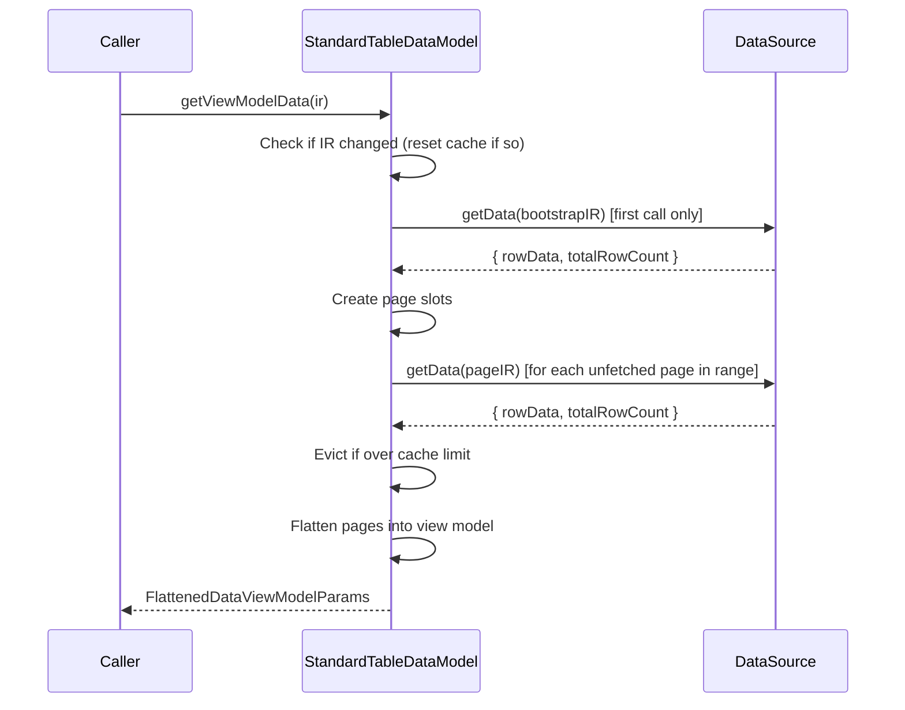

`StandardTableDataModel` is an abstract class that extends [DataModel](/docs/datamodel). It produces flat rows with optional hierarchical row grouping, expand/collapse, and paginated data fetching. It manages an internal page cache to limit how much data the browser holds in memory - since the server typically has far more data than the browser can load at once.

<auto-class-outline path="packages/grid/src/datamodel/standard-table-datamodel.ts" name="StandardTableDataModel" title="Outline" exclude="GridDataViewModelOptions" />

- `TInput` is fixed to `GetRowsIR` - a query describing which rows to fetch (range, grouping, projection, sort, filter)
- `TViewModelData` is fixed to `FlattenedDataViewModelParams` - the flat row structure the renderer expects

## How it works

StandardTableDataModel breaks large datasets into fixed-size pages. When the caller requests a row range via `getViewModelData()`, the model:

1. Checks if the IR (sort, filter, groupBy, project) changed since the last call - if so, resets the page cache
2. Bootstraps page slots by fetching the first page to learn the total row count
3. Identifies which pages overlap the requested `[startRow, endRow]` range
4. Fetches any unfetched pages in parallel
5. Evicts distant pages if the cache exceeds `maxNumPageBeforeEviction`
6. Flattens the page tree into the view model output

<div style={{ maxWidth: '650px', overflowX: 'auto' }}>



</div>

## Configuration

Pass a `StandardTableConfig` to control pagination and caching:

```ts
interface StandardTableConfig {
  pageSize: number;                  // rows per page (default: 10000)
  maxNumPageBeforeEviction: number;  // max fetched pages before eviction (default: 300)
}
```

The constructor and `setConfig()` accept `Partial<StandardTableConfig>` - any fields you omit use the defaults above.

## Implementing a StandardTableDataModel

StandardTableDataModel is abstract. You must implement two methods:

- `getData(ir: GetRowsIR)` - fetches rows from your data source
- `getRangeOfColumn(field: string)` - returns the distinct values or range for a column (used for filtering)

```ts
import { StandardTableDataModel } from "grid";
import { DataSchema, StandardTableConfig, GetRowsIR, GetRowsResponse, ColumnRangeValues } from "grid";

class MyTableDataModel extends StandardTableDataModel {
  private dataSource: MyDataSource;

  constructor(schema: DataSchema[], config: Partial<StandardTableConfig>, dataSource: MyDataSource) {
    super(schema, config);
    this.dataSource = dataSource;
  }

  async getData(ir: GetRowsIR): Promise<GetRowsResponse> {
    // Fetch rows from your data source using the IR
    const result = await this.dataSource.query({
      startRow: ir.startRow,
      endRow: ir.endRow,
      groupPath: ir.groupPath,
      groupBy: ir.groupBy,
      project: ir.project,
      sort: ir.sort,
      filter: ir.filter,
    });
    return { rowData: result.data, totalRowCount: result.total };
  }

  async getRangeOfColumn(field: string): Promise<ColumnRangeValues> {
    const values = await this.dataSource.getDistinctValues(field);
    return { type: "categorical", values };
  }
}
```

## GetRowsIR

The input query that describes what data to fetch:

```ts
interface GetRowsIR {
  startRow: number;      // first row index to fetch (inclusive)
  endRow: number;        // last row index to fetch (exclusive)
  groupBy: string[];     // columns to group by (e.g. ["country", "state"])
  groupPath: string[];   // path into the group hierarchy (e.g. ["USA", "California"])
  project: string[];     // columns to include in the output
  sort: SortEntry[];     // sort instructions
  filter: ScalarFilter[];// filter conditions
}
```

- `groupBy` defines the grouping hierarchy - an ordered list of columns that form the nesting levels. If `groupBy` is `["country", "state", "city"]`, the top level shows distinct countries, the second level shows states within a country, and the third level shows cities within a state.
- `groupPath` tells the data source which level of the hierarchy to fetch from. It is empty `[]` for the top level. When a user [expands](#row-grouping-with-expand-and-collapse) a group row, the model calls `getData` with `groupPath` set to the values leading to that row. For example, with `groupBy: ["country", "state", "city"]`:
  - `groupPath: []` fetches the top-level country rows
  - `groupPath: ["USA"]` fetches states inside "USA" (triggered by `expand(["USA"])`)
  - `groupPath: ["USA", "California"]` fetches cities inside California (triggered by `expand(["USA", "California"])`)
- `project` lists which columns appear in the output.

## GetRowsResponse

The response your `getData` implementation must return:

```ts
interface GetRowsResponse {
  rowData: any[][];      // column-major data arrays
  totalRowCount: number; // total number of rows at this level (for pagination)
}
```

`rowData` is column-major - each inner array holds all values for one column. For grouped queries, the first column contains the group values; remaining columns hold aggregated measures.

## Row grouping with expand and collapse

When `groupBy` is non-empty, the model displays group rows that can be expanded to reveal children. Use `expand()` and `collapse()` to control which groups are open:

```ts
// Initial fetch - shows top-level group rows
const vm = await model.getViewModelData({
  startRow: 0,
  endRow: 100,
  groupBy: ["country", "state"],
  project: ["country", "state", "revenue"],
  sort: [],
  filter: [],
  groupPath: [],
});

// Expand the "USA" group - fetches its children (states)
const expanded = await model.expand(["USA"]);

// Expand "California" under "USA" - fetches leaf rows
const deeper = await model.expand(["USA", "California"]);

// Collapse "USA" - hides children but keeps them cached
const collapsed = await model.collapse(["USA"]);

// Re-expanding "USA" is instant (cache hit, no getData call)
const reexpanded = await model.expand(["USA"]);
```

Key behaviors:

- `expand(groupPath)` fetches child data and marks the group as expanded
- `collapse(groupPath)` marks the group as collapsed but keeps child data in cache
- Re-expanding a collapsed group is a cache hit - no network call
- Both methods return the updated `FlattenedDataViewModelParams`

## Page cache and eviction

The model maintains a tree of `PageNode` objects. Each page holds a fixed number of rows (controlled by `pageSize`). Pages start with `data: null` and are filled on demand.

When the number of fetched pages exceeds `maxNumPageBeforeEviction`, the model evicts the page farthest from the current scroll position. Eviction nulls out the page's data and recursively evicts all child pages under expanded rows in that page.

## Updating configuration

Call `setConfig()` to change pagination or cache settings at runtime. This resets the page cache:

```ts
model.setConfig({ pageSize: 5000, maxNumPageBeforeEviction: 100 });
```

## Querying expanded state

Use `getExpandedPaths()` to get all currently expanded group paths:

```ts
const paths = model.getExpandedPaths();
// e.g. [["USA"], ["USA", "California"], ["Germany"]]
```

## API Reference

Extends [DataModel](/docs/datamodel#api-reference).

<auto-type-table path="packages/grid/src/datamodel/standard-table-datamodel.ts" type="Omit<StandardTableDataModel, keyof DataModel<any, any> | 'topLevelRowCount' | 'setViewModelOptions'> & Pick<StandardTableDataModel, 'getViewModelData'>" origname="StandardTableDataModel" />
